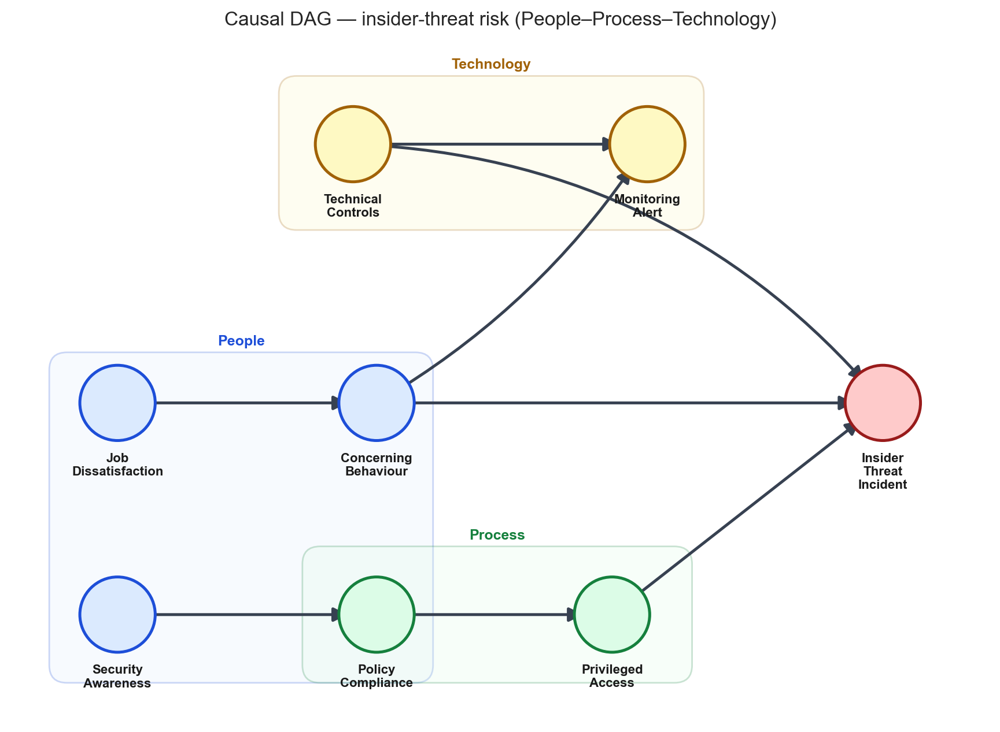
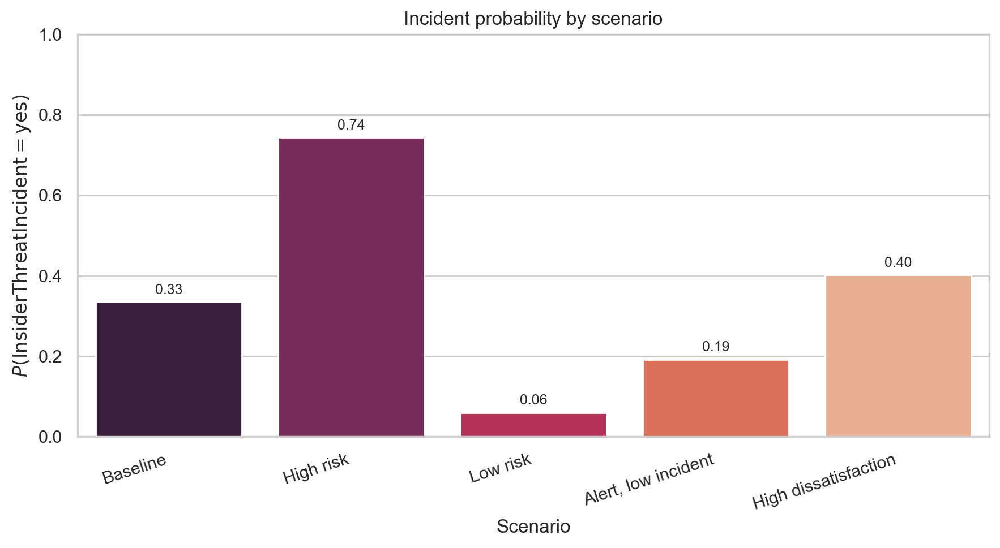
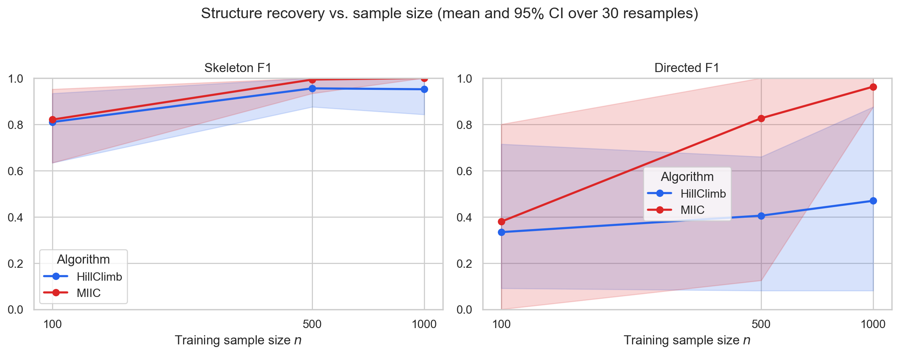
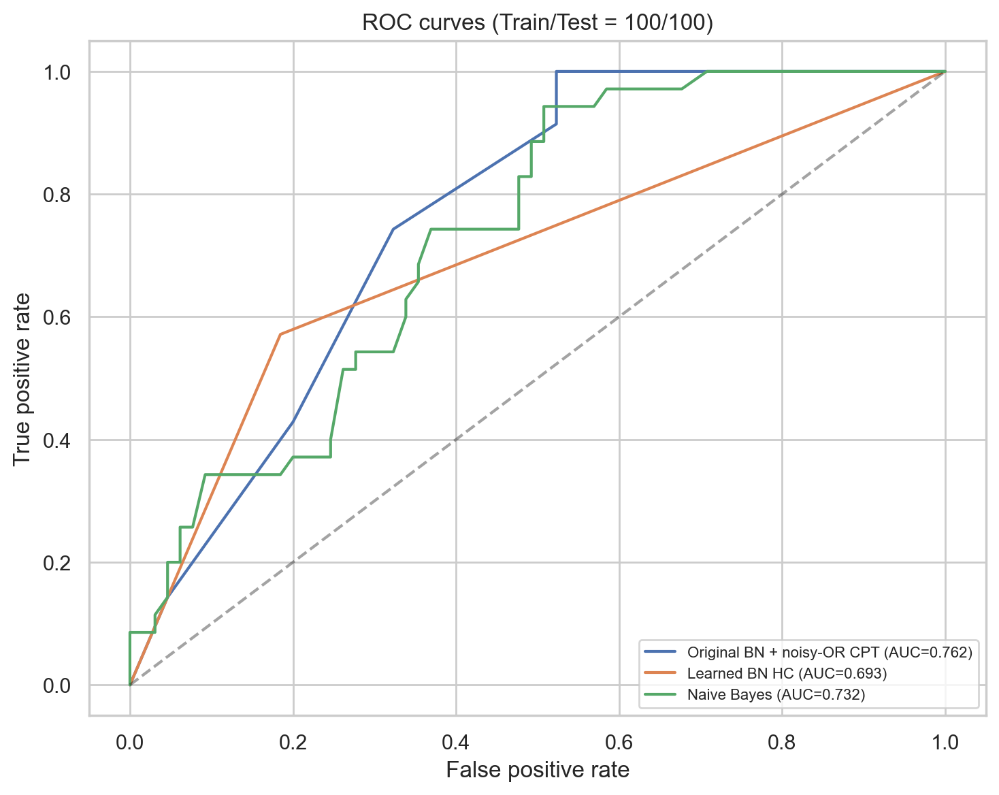
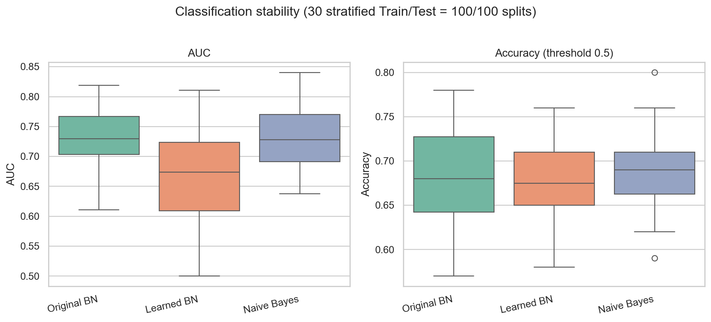
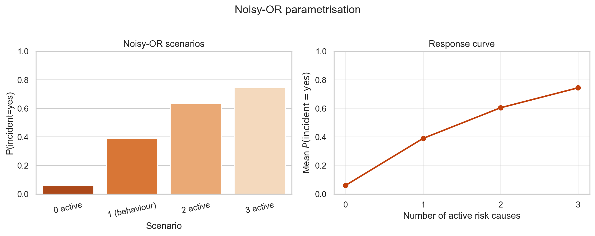

# Report: Bayesian Network for Insider-Related Cyber Security Risk

**Course:** Bayesian Reasoning and Learning  
**Author:** Jan Ruijgrok (852796035)  
**Institution:** Open Universiteit Nederland  
**Language:** English  
**Target length:** ~6 pages (main text; appendix optional)

---

## Abstract

When security teams assess insider threats, they usually face incomplete evidence from human resources, access management, and monitoring systems. Real incident data are rarely available for model building. This report develops and evaluates a compact Bayesian network for malicious insider-related cyber security risk. Experts specify which people, process, and technology factors influence one another; the model then updates incident probability as new observations arrive. The network is validated through inference on expert-defined scenarios. It is further tested with synthetically generated cases, to see whether standard learning procedures can recover the intended structure and predict incident outcomes on unseen cases. Inference yields clearly separated low- and high-risk profiles; intermediate cases behave in line with the intended causal logic. Structure recovery improves with more training data, but learning the direction of causal links remains harder than recovering overall connectivity. On small test sets, no single modelling approach clearly outperforms the others. Overall, the work demonstrates a coherent and interpretable modelling pipeline under data scarcity. It should be read as a proof of concept for analyst prioritisation, not as validation on live security operations data or as an autonomous detection system.

---

**Keywords:** insider threat; cyber security risk; Bayesian network; noisy-OR; structure learning; classification; ROC curve; People–Process–Technology.

### Notation and symbols

**Table 1 — Main mathematical symbols.**

| Symbol | Meaning |
|--------|---------|
| \(I\) | InsiderThreatIncident |
| \(E\) | Evidence (any subset of observed node states) |
| \(P(I=\text{yes}\mid E)\) | Posterior probability of a malicious insider-related incident |
| CPT | Conditional probability table |
| \(q\) | Noisy-OR *leak* probability on the incident node |
| \(p_i\) | Noisy-OR *inhibition* for activator \(i\) (behaviour, access, controls) |
| \(n\) | Training sample size for structure learning (100, 500, 1000) |
| \(N\) | Total synthetic cases sampled from the ground-truth BN (2000) |
| AUC | Area under the receiver-operating-characteristic (ROC) curve |
| F1 | \(F_1\) score for skeleton or directed graph vs. ground truth |

**Table 2 — Network variables (eight nodes).**

| Variable | States | P–P–T | Role in model | Description |
|----------|--------|-------|---------------|-------------|
| JobDissatisfaction | low, medium, high | People | Root cause | Level of employee dissatisfaction or frustration with work or the work environment. |
| SecurityAwareness | low, medium, high | People | Root cause | Employee knowledge and awareness of security risks and safe behaviour. |
| PolicyCompliance | good, poor | Process | Intermediate | Extent to which employees and processes adhere to security policy. |
| ConcerningBehaviour | no, yes | People | Risk indicator | Whether behaviour has been observed that suggests possible malicious intent or misuse (e.g. anomalous data access). |
| PrivilegedAccess | appropriate, excessive | Technology/Process | Risk indicator | Whether access rights are appropriate for the role or excessively granted. |
| TechnicalControls | weak, adequate | Technology | Risk indicator | Strength of preventive and detective technical measures (firewalls, logging, Data Loss Prevention, etc.). |
| MonitoringAlert | no, yes | Technology | Observable signal | Whether the monitoring system has generated an alert based on behavioural or technical signals. |
| **InsiderThreatIncident** | no, yes | Outcome | **Class** (target) | Whether a malicious insider-related security incident has actually occurred (e.g. data breach or access misuse). |

---

## 1. Introduction

When a security team suspects an insider threat, the picture is usually incomplete. Human resources may report low morale, identity tools may flag excessive privileged access, and a monitoring system may raise an alert—yet it remains unclear how likely a real malicious insider incident is. Large, shareable datasets on such incidents barely exist: cases are rare, sensitive, and seldom published.

Bayesian Networks (BNs) are a common response in cyber security (Chockalingam et al., 2017). Experts specify which factors influence which others, assign probabilities, and the model updates risk as observations arrive. A flat classifier could rank cases. It would not, however, separate causal structure from parameters or support transparent what-if queries.

Chockalingam et al. reviewed seventeen published BN models in this field. Most are small and draw heavily on expert judgement for their probabilities. They combine people, process, and technology variables, focus on malicious insiders, and rarely integrate insider–outsider attacks. Earlier insider-threat models link dissatisfaction, behaviour, and access misuse to higher risk (Axelrad et al., 2013).

Against that background we build and test a compact eight-node network (Tables 1–2). Our goal is to assess whether such an expert-built model can help analysts prioritise cases when signals are only partly visible and shareable incident data are scarce. We hypothesise that a domain-informed causal network yields interpretable risk estimates and remains competitive with data-driven alternatives on synthetically generated cases. We therefore examine scenario inference from expert probabilities, structure recovery as training data grow, incident prediction against learned and simpler classifiers on a small unseen set, and whether a parsimonious incident parameterisation preserves rising risk when more warning signs are active.

---

## 2. Methods

### 2.1 Setup

Four steps: (1) specify the DAG and CPTs by expert judgement and test by inference only; (2) generate \(N=2000\) synthetic cases from that BN because real insider logs are unavailable; (3) run structure learning and classification on held-out subsets; (4) compare noisy-OR with a fuller incident CPT.

For classification we draw Train/Test \(=100/100\) cases from a 300-row pool, **stratified** on the incident label. Learning experiments are deliberately circular—they measure recoverability of a known graph, not external validity.

### 2.2 Network

Roots capture dissatisfaction and security awareness; process compliance shapes access; people and technology indicators feed the incident node. Causally, dissatisfaction may precede concerning behaviour; weak controls influence both incidents and alerts. The incident CPT is a noisy-OR over three activators: concerning behaviour (yes), excessive privileged access, and weak technical controls.

Figure 1 summarises the structure.

### 2.3 Learning

For each \(n\in\{100,500,1000\}\), learn structure and compare to the manual DAG (skeleton/directed F1, Hamming distance). For classification, we fix Train/Test \(=100/100\) (stratified): *original* BN (expert DAG, CPTs on Train), *learned* BN (Hill Climbing on Train), and *naive Bayes* on the same variables. Primary metric: AUC. Each experiment is repeated over 30 independent resamples (mean and 95% percentile intervals). We compare four noisy-OR parameters with seven in a fuller logistic CPT, inspect \(P(I=\text{yes})\) as activators turn on, and contrast Hill Climbing with MIIC for structure recovery.

### 2.4 Data management

All learning cases are simulated from the ground-truth BN (\(N=2000\)); no identifiable employee records were collected.

---

## 3. Results

### 3.1 Inference validation

With no parameters learned from external data, the fixed BN is queried under alternative evidence profiles. Table 3 lists \(P(I=\text{yes})\) under five evidence profiles.

| Scenario | Key evidence | \(P(I=\text{yes})\) |
|----------|--------------|---------------------|
| Baseline | (none) | 0.334 |
| High risk | CB=yes, PA=excessive, TC=weak | 0.743 |
| Low risk | CB=no, PA=appropriate, TC=adequate | 0.060 |
| Alert, low incident | MA=yes, CB=no, TC=adequate | 0.192 |
| High dissatisfaction | JD=high | 0.403 |

Leak sensitivity (\(q\in\{0.90,0.94,0.97\}\)): high-risk stays above baseline and low-risk in all runs.

Figure 2 displays the same scenario outcomes graphically.

- Marginals: adequate technical controls and mostly good policy compliance dominate; concerning behaviour remains a minority state.
- Conditionals: \(P(\text{incident}\mid\text{concerning behaviour})\) exceeds baseline; weak controls and excessive access increase incident probability.
- Sensitivity (leak): baseline and high-risk scenarios stay ordered across leak \(\in\{0.90,0.94,0.97\}\).

### 3.2 Structure recovery

Training subsets are drawn from the \(N=2000\) synthetic sample; learned structures are compared to the manual DAG.

| \(n\) | Algorithm | Skeleton F1 | Directed F1 | Hamming |
|------|-----------|-------------|-------------|---------|
| 100 | HillClimb | 0.667 | 0.400 | 5 |
| 100 | MIIC | 0.667 | 0.400 | 5 |
| 500 | HillClimb | 0.824 | 0.118 | 3 |
| 500 | MIIC | 0.933 | 0.667 | 1 |
| 1000 | HillClimb | 0.889 | 0.222 | 2 |
| 1000 | MIIC | 1.000 | 1.000 | 0 |

Figure 3 plots mean skeleton and directed \(F_1\) with 95% intervals over 30 resamples.

Stability summary:

| \(n\) | Algorithm | Skeleton F1 (mean [95% CI]) | Directed F1 (mean [95% CI]) |
|------|-----------|------------------------------|------------------------------|
| 100 | HillClimb | 0.838 [0.687, 1.000] | 0.383 [0.000, 0.618] |
| 100 | MIIC | 0.854 [0.687, 1.000] | 0.352 [0.000, 0.821] |
| 500 | HillClimb | 0.953 [0.786, 1.000] | 0.494 [0.131, 0.784] |
| 500 | MIIC | 0.996 [0.933, 1.000] | 0.761 [0.397, 1.000] |
| 1000 | HillClimb | 0.941 [0.842, 1.000] | 0.455 [0.000, 0.838] |
| 1000 | MIIC | 1.000 [1.000, 1.000] | 0.954 [0.875, 1.000] |

**Interpretation:** Mean skeleton \(F_1\) rises with \(n\) for both algorithms. Directed recovery remains harder and more variable for Hill Climbing; intervals stay wide at all \(n\). MIIC reaches mean directed \(F_1 \approx 0.95\) at \(n=1000\) with a narrower band. Constraint-based learning can therefore outperform greedy search on arrow direction when the generating graph is known, even though both algorithms see the same data.

### 3.3 Classification comparison (Train=100, Test=100)

One reference train–test split; three classifiers target the incident outcome.

| Model | AUC | Accuracy |
|-------|-----|----------|
| Original BN + noisy-OR CPT | 0.683 | 0.64 |
| Learned BN HC | 0.695 | 0.64 |
| Naive Bayes | 0.704 | 0.68 |

Figure 4 compares the three classifiers on this single test set.

### 3.4 Classification stability (30 resamples)

| Model | AUC (mean [95% CI]) | Accuracy (mean [95% CI]) |
|-------|---------------------|---------------------------|
| Original BN + noisy-OR CPT | 0.743 [0.675, 0.798] | 0.686 [0.626, 0.733] |
| Learned BN HC | 0.685 [0.468, 0.830] | 0.683 [0.640, 0.745] |
| Naive Bayes | 0.715 [0.599, 0.796] | 0.682 [0.625, 0.750] |

The 95% intervals overlap for all three models on AUC and accuracy. The reference split (§3.3) is therefore not representative of every resample: a single train/test draw can rank models differently. Stability analysis supports treating classification differences as modest rather than definitive.

### 3.5 Noisy-OR

Parametric choice for the incident node is evaluated for complexity and monotonic multi-cause risk.

| Parameterisation | Free params (incident node) |
|------------------|----------------------------|
| Full logistic CPT | 7 |
| Noisy-OR (leak + 3 inhibitions) | 4 |

Figure 5 shows scenario rankings and monotonic risk accumulation as more activators switch on.

---

## 4. Conclusions and discussion

### 4.1 Summary of findings

This study asked whether a compact, expert-built Bayesian Network can support insider-threat prioritisation when real incident data are scarce. The results suggest a qualified yes.

Scenario inference produced stable, interpretable risk estimates. High- and low-risk profiles separated clearly; intermediate cases behaved in line with the DAG. On synthetic data, skeleton recovery improved with sample size; directed recovery stayed harder for Hill Climbing while MIIC reached mean directed \(F_1 \approx 0.95\) at \(n=1000\). Classification intervals overlapped across models. Noisy-OR offered a parsimonious incident parameterisation with monotonic multi-cause risk.

### 4.2 Limitations

The evaluation is inward-looking: simulated learning data measure recoverability of a known graph, not external validity; CPTs reflect expert judgement, not operational calibration. The scope is a static malicious-insider People–Process–Technology graph (Chockalingam et al., 2017); temporal HR and alert dynamics (e.g. dynamic BNs) are not modelled. Small train and test sets (\(n=100\) each) widen intervals: overlapping 95% AUC bands (original BN 0.743 vs. naive Bayes 0.715) do not support definitive classifier ranking.

### 4.3 Implications and future work

Expert causal structure explains *why* risk rises and remains competitive on average with learned alternatives. The pipeline is a proof of concept, not validation on live security-operations data; deployment would require human review and auditability. A realistic next step is to map operational feeds to the eight nodes, preregister elicitation and evaluation, document CPT workshops with sensitivity analysis, and trial analyst-facing scores with mandatory human review.

---

## References

Axelrad, E. T., Sticha, P. J., Brdiczka, O., & Shen, J. (2013). A Bayesian network model for predicting insider threats. In *2013 IEEE Security and Privacy Workshops* (pp. 82–89). IEEE.

Chockalingam, S., Pieters, W., Herdeiro Teixeira, A., & van Gelder, P. (2017). Bayesian network models in cyber security: A systematic review. In *Proceedings of NordSec 2017* (LNCS 10674, pp. 105–122). Springer. https://doi.org/10.1007/978-3-319-70290-2_7

---

## Appendix — Additional figures

*[Optional: full recovery table, CPT excerpts, side-by-side BN at n=1000.]*
